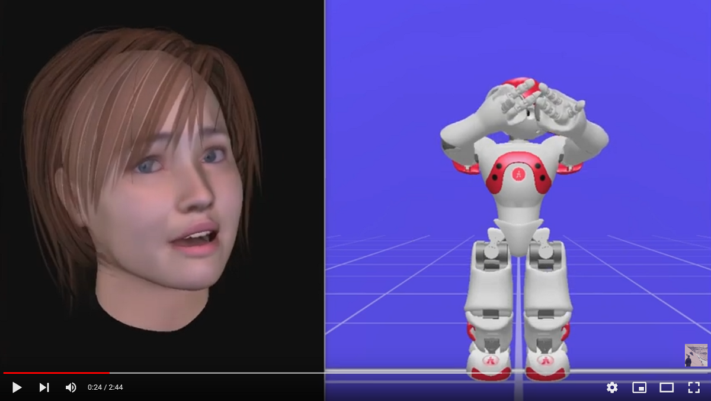

# IntelligentaInteraktivaSystem

Project, assignment and labs for the Uppsala University course 1MD032 Intelligent Interactive Systems.

### Assignment

Following from computer vision and machine learning labs, this is an assignment for emotional classification of facial and body features as either positive, negative or neutral. Implemented in Python using the sklearn library and PyCharm IDE, the k-nearest neighbour and linear support vector machine algorithms are evaluated using k-fold cross-validation on input data consisting of 100 body features and 11 geometrical facial features between specific points of interest, including:

- lip states (distance between lip corners)
- mouth open
- eye blinking (first)
- eye blinking (second)
- eyebrow
- face zoom
- eye-eyebrow separation
- head yaw
- lip shape(first)
- lip shape (second)
- eyebrow raise

### Project

A group project for automating survey research-based artificial emotional responses mapped to supervised machine 
learning classified computer vision detected facial expressions as either any of the following six basic human emotions:
- Anger
- Disgust
- Fear
- Happiness
- Sadness
- Surprise

Emotional responses are displayed on a virtual humanoid face and NAO robot using IrisTK and Choregraphe, respectively:

A real-sense camera is used for facial detection with HOG classifiers and an ensemble of 
regression trees to reduce facial landmark coordinates that are mapped to depth information. 
The mapped coordinates are input to a trained neural network model for classifying the 
detected emotional expression which is mapped to a corresponding artificial emotional response. 
The project is implemented in Python using the sklearn, pandas, numpy and tensorflow 
libraries with PyCharm IDE and is developed as three separate components integrated into a pipeline. 
This repository is for hosting the emotional synthesis component.

Emotional Synthesis Team:
- Farangis Hakami
- [Alexis Remmers](https://github.com/Thizizmyname)
- [Adam Ross](https://github.com/R055A)

Pipeline Team:
- Ya-Ting Chang
- [Sofia Ellergren](https://github.com/sofiaelle)
- [Nils Erlanson](https://github.com/NilsErlanson)
- [Ryan Foo](https://github.com/ryan-foo?tab=repositories)
- Farangis Hakami
- Wei-Ting Ho
- Jih-Tang Hsieh
- [Abishek Balu Kothandaraman](https://github.com/abishekbalu)
- [Alexis Remmers](https://github.com/Thizizmyname)
- [Adam Ross](https://github.com/R055A)
- [Evangelia Spachou](https://github.com/EvangeliaSp)
- Yu-Wen Yang

